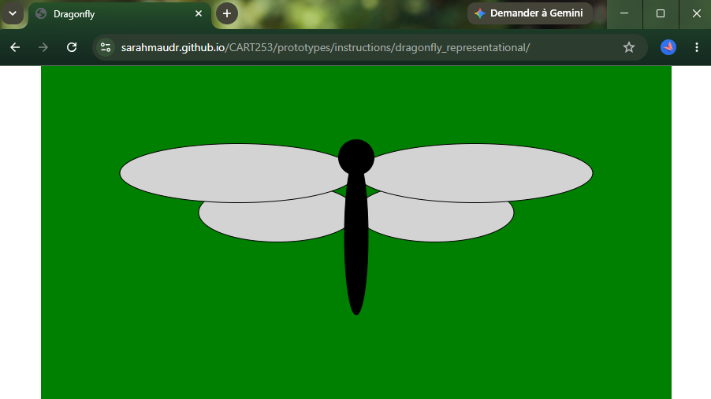
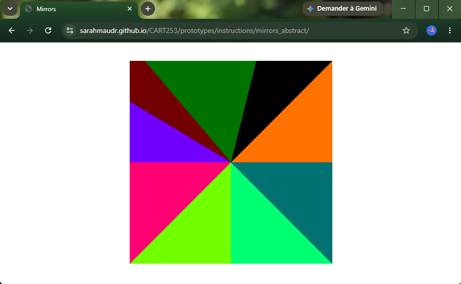
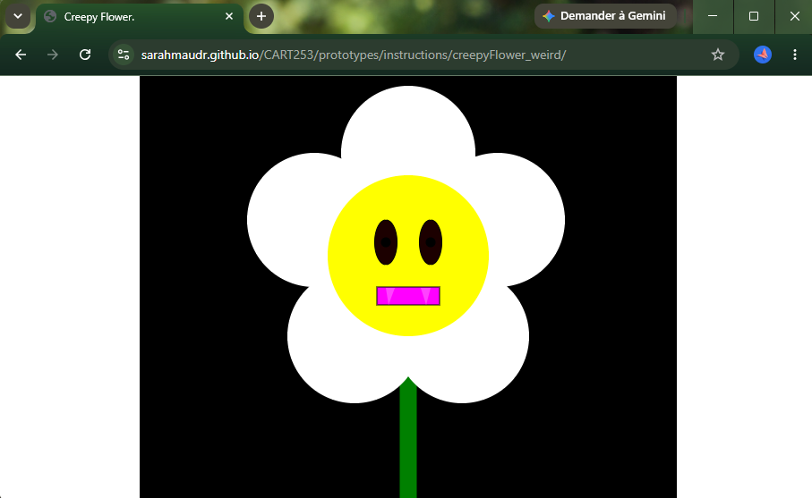

# Sarah-Maude's prototyping website

## Description
This is Sarah-Maude Roy’s coursework repository for CART253. The purpose of this website is to collect, document and present my prototyping work throughout the course. Here, you will find my reflective journal, experimental prototypes and useful links.

## Useful links
* [Reflective Journal](journal.md)

## Prototypes
## Pototyping: Instructions assignment
### The dragonfly

- [Running Prototype](https://sarahmaudr.github.io/CART253/prototypes/instructions/dragonfly_representational/)
- [Code Repository](https://github.com/sarahmaudr/CART253/blob/main/prototypes/instructions/dragonfly_representational/js/script.js)

### Mirrors

- [Running Prototype](https://sarahmaudr.github.io/CART253/prototypes/instructions/mirrors_abstract)
- [Code Repository](https://github.com/sarahmaudr/CART253/blob/main/prototypes/instructions/mirrors_abstract/js/script.js)

### Creepy Flower

- [Running Prototype](https://sarahmaudr.github.io/CART253/prototypes/instructions/creepyFlower_weird/)
- [Code Repository](https://github.com/sarahmaudr/CART253/blob/main/prototypes/instructions/creepyFlower_weird/js/script.js)