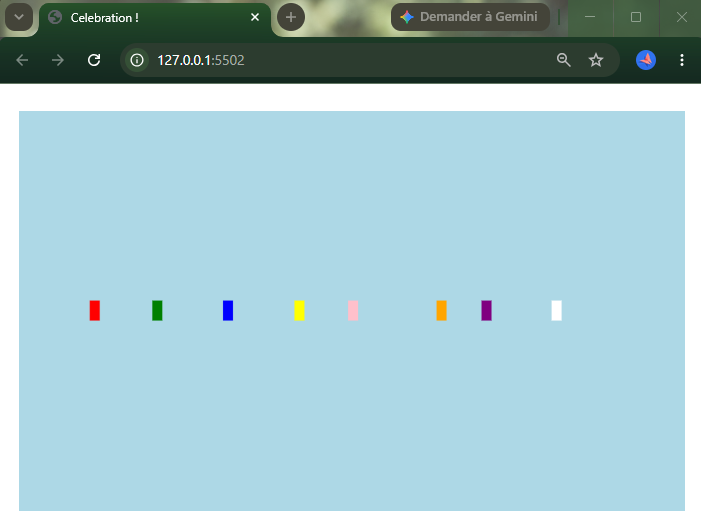

# Reflective Journal

## 2026-09-11

Making this website with Markdown and Github was a great introductory exercise for this class. Having spent a year studying computer science before starting this program, I was already familiar with some of the basics of Markdown syntax. However, this was my first time including local images and using file paths to link separate pages into a repository.

The Markdown Cheat Sheet made the assignment easier. I liked how well everything was explained and that everything I needed was on a single page. I will definitely be using it again as a reference.

Although I have used VS Code in the past, I did not know we could view a live preview of our Markdown files directly inside the editor. It made checking my formatting so much easier before going to the next step.

The main challenge was using the correct file path to link my banner image. I wasn't sure how to structure the link even with the cheat sheet, but I eventually figured it out, and now that I know how, it is pretty easy.
I hope the future audience for my work will think my website is well-organized and clear. As I move forward in this course, I look forward to exploring creative web prototyping and using new tools.

## 2026-09-19

Working on these three prototypes was a really cool way to explore different design concepts. I ended up making a dragonfly for my representative piece, a geometric 'mirror' design for my abstract one and a transforming flower for the weird concept. It was a great way to see how interactive elements can completely change a project. 

What surprised me the most was how much 'mouvement' you can get out of simple geometry. For my abstract prototype, I drew multiple triangles that all meet in the center of the page. I coded each triangle to change to a different color as the mouse moves, which ended up creating some kind of 'mirror effect' that looks like it's reflecting lights.

The coolest part of this project was working on the weird prototype. I started with a normal flower, but as you move the cursor down the page, its eyes turn red and vampire teeth appear. It was really fun to play with the element of surprise.

The main challenge was the math behind the abstract piece and making sure all the triangle were alligned.

I hope people who look at my prototypes enjoy enteracting with them and find the transitions unexpected. As I move forward, I would love to develop the abstract mirror prototype further, maybe by turning it 3D.

## 2026-09-26
With the 3 prototypes, I explored visual motion and user interactivity.
What surprised me most in my 'My head is on fire' project was using 'random()' creates unpredictable (or almost) results. It makes the fire in my project look more real, because fire is unpredictable. In contrast, in my 'nightmare' project, 'mouseX' and 'colorMode(RGB, 1000)' are controlled and give the expected result.

The coolest discovery was seeing how canvas works. Leaving background("black") in setup() allowed the flame and smoke shapes to accumulate over time, building up a dense texture on top of the character's head. In contrast, for the 'celebration' project, the 'background()' needed to be inside 'draw()' to avoid streaks. The hardest part for me was to figure that out!

I hope anyone viewing my work experience both humor and suspense throughout my different pieces. Moving forward, I would love to find a way to, for example, make the faces in 'nightmare' appear with a click of the mouse instead of its movement, and make the confetti fall more naturally.

